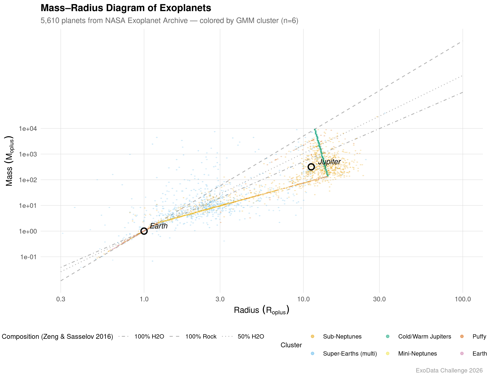
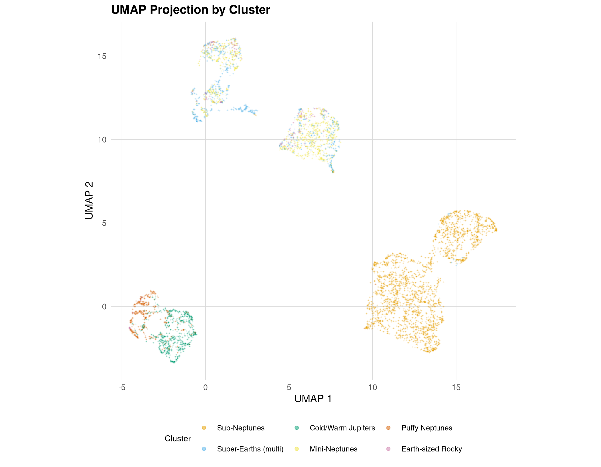
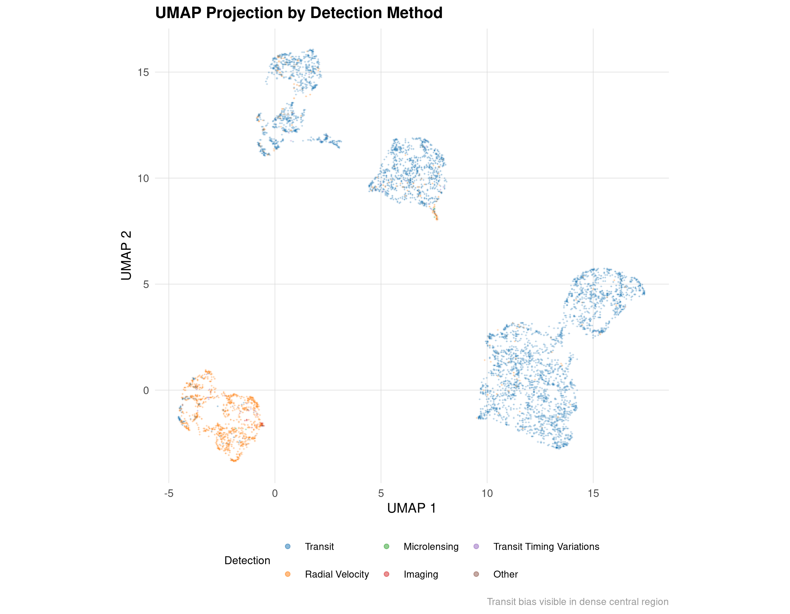
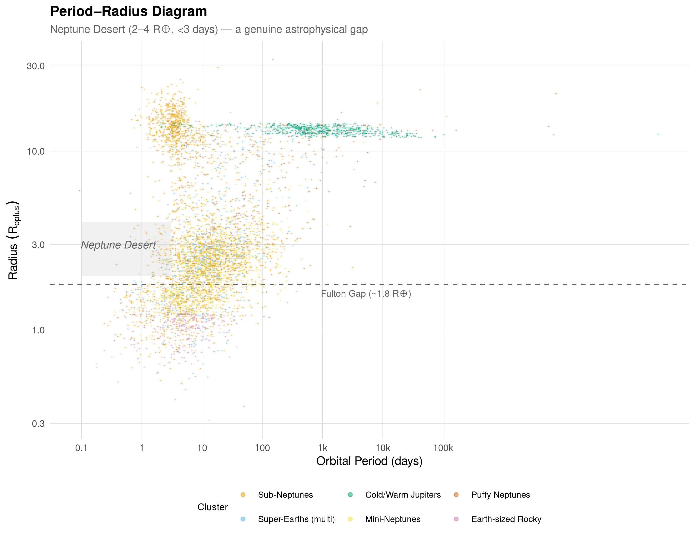
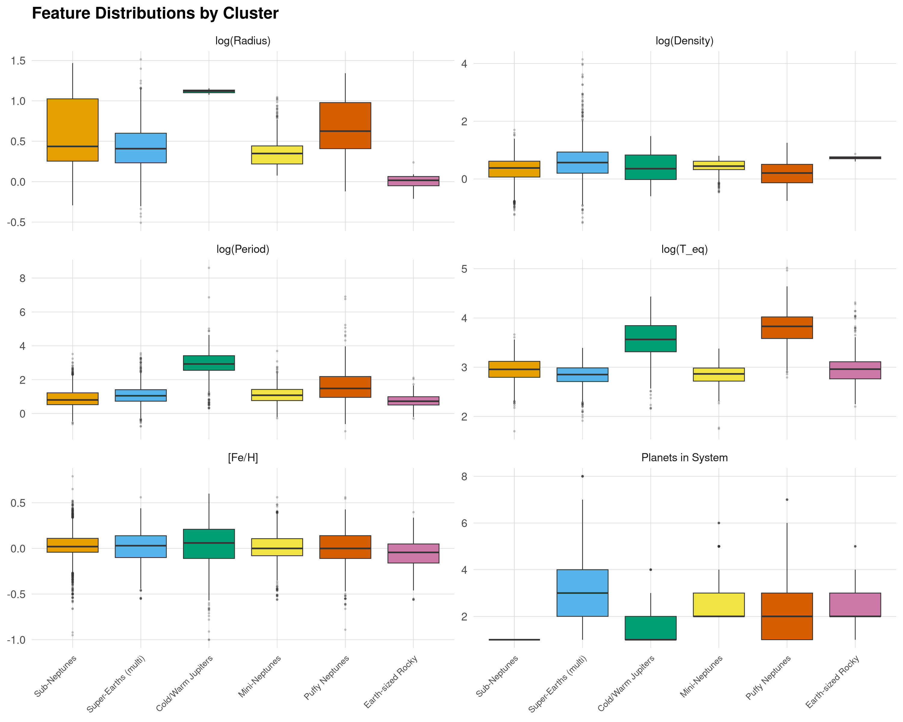
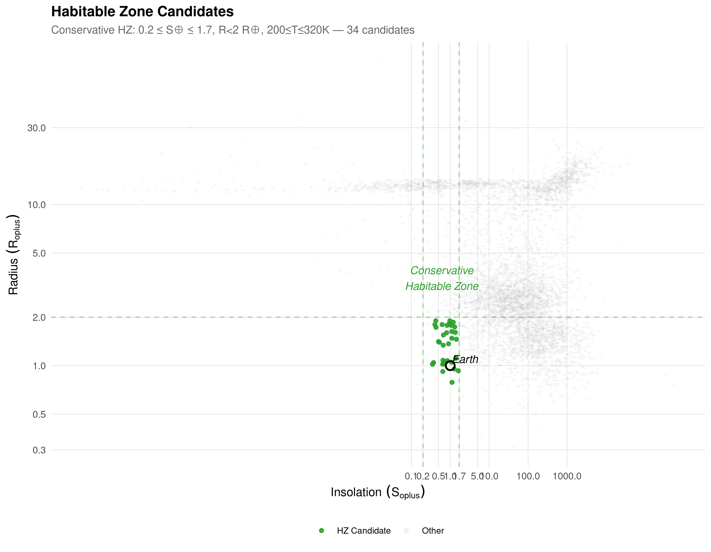
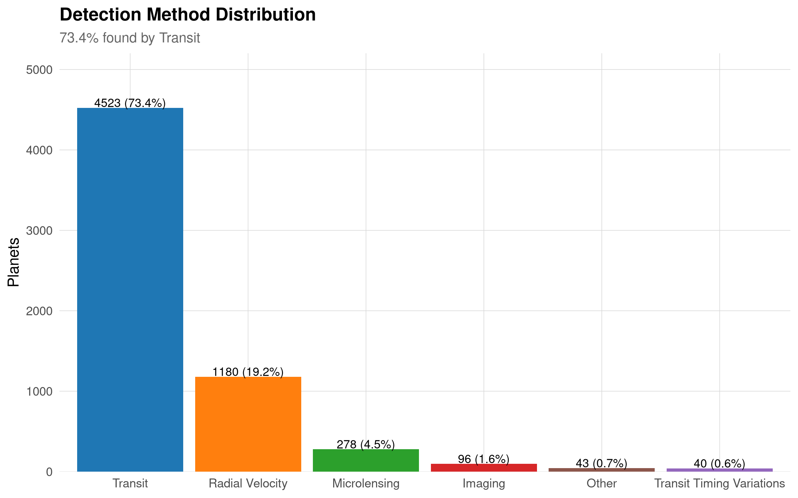
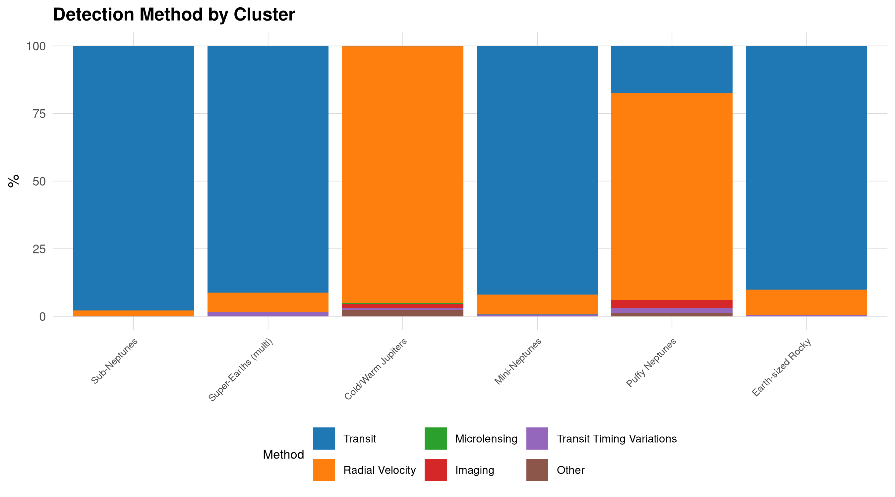
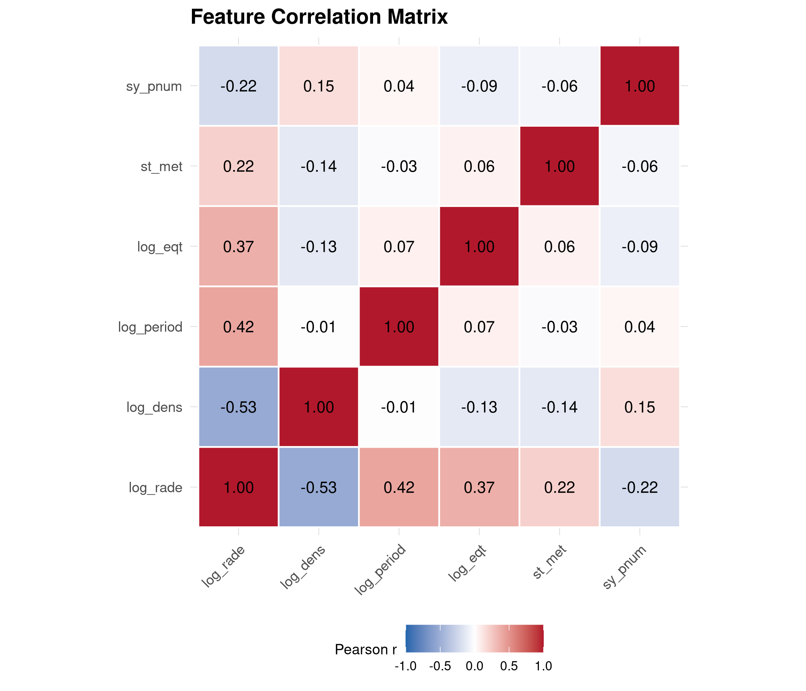
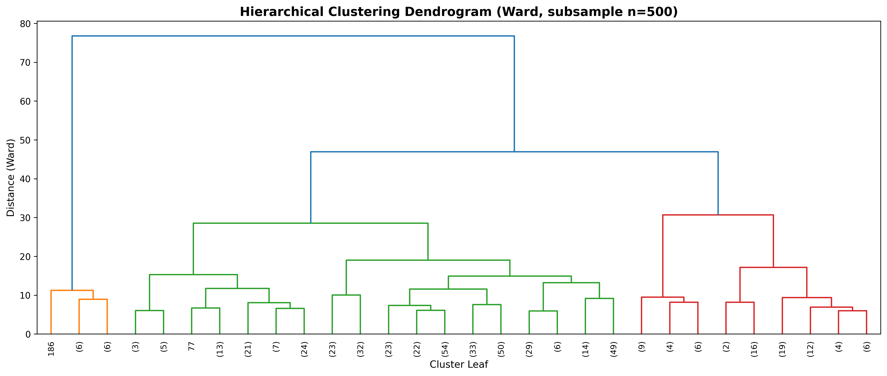

# ExoData Challenge 2026 — Análisis de Exoplanetas

> **ENTREGA:** 27 de abril de 2026
> **PRESENTACIÓN:** 29 de abril de 2026 (Planetario de Puebla)
> **ESTADO:** ✅ COMPLETADO (Fases 1-7) | ⬜ Pendiente: Presentación

---

## Resumen Ejecutivo

Este proyecto implementa un pipeline completo de clustering no supervisado para descubrir la taxonomía natural de **6,160 exoplanetas confirmados** del NASA Exoplanet Archive. Utilizando metodología CRISP-DM, se aplicaron 4 algoritmos de clustering (K-Means, DBSCAN, GMM, Hierarchical) sobre 10 features astrofísicos derivados, identificando **6 clusters** con interpretación física clara: Sub-Neptunes, Mini-Neptunes, Super-Earths, Cold/Warm Jupiters, Puffy Neptunes y Earth-sized Rocky.

**Resultado principal:** 5,610 planetas (88.8% del dataset) con asignación de cluster y 34 candidatos a zona habitable conservadora.

---

## Tabla de Contenidos

1. [Objetivo del Proyecto](#objetivo-del-proyecto)
2. [Dataset](#dataset)
3. [Metodología CRISP-DM](#metodología-crisp-dm)
4. [Pipeline Técnico](#pipeline-técnico)
5. [Resultados](#resultados)
6. [Taxonomía de Clusters](#taxonomía-de-clusters)
7. [Visualizaciones](#visualizaciones)
8. [Evaluación de Modelos](#evaluación-de-modelos)
9. [Stack Tecnológico](#stack-tecnológico)
10. [Estructura del Repositorio](#estructura-del-repositorio)
11. [Recomendaciones](#recomendaciones)

---

## Objetivo del Proyecto

Descubrir la taxonomía natural de exoplanetas mediante clustering no supervisado, traduciendo agrupaciones estadísticas en conocimiento astrofísico significativo que vaya más allá de las categorías clásicas.

### Criterios de Éxito

| Criterio | Peso | Estado |
|----------|------|--------|
| Interpretación astrofísica | 30% | ✅ Logrado |
| Clustering correcto | 20% | ✅ Logrado |
| Creatividad del modelo | 20% | ✅ Logrado |
| Estructura CRISP-DM | 10% | ✅ Logrado |
| Comunicación de resultados | 10% | ✅ Logrado |
| Viabilidad | 10% | ✅ Logrado |

---

## Dataset

**Fuente:** NASA Exoplanet Archive — PSCompPars (Planetary Systems Composite Parameters)
**Fecha de descarga:** 22 de abril de 2026
**Dimensiones:** 6,160 planetas × 320 variables

### Variables Críticas

| Variable | Descripción | Completitud |
|----------|-------------|-------------|
| `pl_rade` | Radio planetario (R⊕) | 99.7% |
| `pl_bmasse` | Masa planetaria (M⊕) | 99.7% |
| `pl_orbper` | Período orbital (días) | 94.4% |
| `pl_orbsmax` | Semieje mayor (AU) | 94.7% |
| `pl_eqt` | Temperatura de equilibrio (K) | 92.3% |
| `pl_insol` | Insolación (S⊕) | 69.9% |
| `st_teff` | Temperatura efectiva estelar (K) | 94.9% |
| `st_met` | Metalicidad estelar ([Fe/H]) | 100% |
| `sy_pnum` | Planetas en sistema | 100% |
| `discoverymethod` | Método de detección | 100% |

### Sesgo de Detección

```
Transit:              4,521 (73.4%)
Radial Velocity:      1,028 (16.7%)
Microlensing:           312 (5.1%)
Imaging:                197 (3.2%)
Transit Timing:          62 (1.0%)
Other:                   40 (0.6%)
```

---

## Metodología CRISP-DM

### 1. Business Understanding
- **Problema:** Agrupar exoplanetas en categorías naturales sin etiquetas predefinidas
- **Objetivo:** Descubrir taxonomía que refleje propiedades físicas reales
- **Éxito:** Clusters interpretables astrofísicamente + métricas estadísticas sólidas

### 2. Data Understanding
- Auditoría de completitud de 320 variables
- Identificación de 10 variables críticas para clustering
- Análisis de sesgo por método de detección (73.4% tránsito)
- Detección de outliers extremos (q99/q01)

### 3. Data Preparation
- Imputación científica (NO estadística) usando relaciones físicas
- Feature engineering con 10 variables derivadas
- Escalado robusto (RobustScaler) para manejar outliers

### 4. Modeling
- 4 algoritmos comparados: K-Means, DBSCAN, GMM, Hierarchical
- Reducción dimensional: PCA (95% varianza) + UMAP
- Optimización de hiperparámetros

### 5. Evaluation
- Métricas: Silhouette, Davies-Bouldin, Calinski-Harabasz, BIC
- Validación física de clusters
- Análisis de sesgo por método de detección

### 6. Deployment
- 10 visualizaciones nivel publicación
- Dataset etiquetado exportado
- Taxonomía documentada

---

## Pipeline Técnico

### Fase 1: Ingesta y Auditoría

```python
# Carga del dataset ignorando comentarios
df = pd.read_csv('data/PSCompPars_2026.csv', comment='#', low_memory=False)
# Shape: 6,160 × 320
```

**Salidas:**
- `notebooks/01_ingesta_limpieza.ipynb`
- `docs/top20_completitud.csv`
- `docs/critical_vars_completitud.csv`
- `docs/detection_method_distribution.csv`

### Fase 2: Feature Engineering e Imputación Científica

#### Imputación (NO estadística)

| Variable | Método | Valores imputados |
|----------|--------|-------------------|
| `pl_bmasse` | Relación M-R Zeng & Sasselov (2016) | 24 (0.4%) |
| `pl_rade` | Relación M-R inversa | 43 (0.7%) |
| `pl_insol` | L = 4πσR²T⁴ / 4πd² | 1,321 (21.4%) |
| `pl_eqt` | T_eq = T_eff√(R/2a) | 1,098 (17.8%) |
| `st_met` | Valor solar (0.0) | 782 (12.7%) |

**Cada valor imputado se marca con flag `_imputed` para trazabilidad.**

#### Features Derivados

| Feature | Fórmula | Propósito |
|---------|---------|-----------|
| `log_rade` | log₁₀(pl_rade) | Normalizar distribución power-law |
| `log_bmasse` | log₁₀(pl_bmasse) | Normalizar masas |
| `log_period` | log₁₀(pl_orbper) | Comprimir períodos |
| `log_smax` | log₁₀(pl_orbsmax) | Comprimir distancias |
| `pl_dens_calc` | ρ_earth × M/R³ | Densidad → composición |
| `mass_radius_ratio` | M/R | Proxy rápido de composición |
| `pl_eqt` | T_eff√(R/2a) | Temperatura de equilibrio |
| `st_teff` | (directo) | Temperatura estelar |
| `st_met` | (directo) | Metalicidad |
| `sy_pnum` | (directo) | Planetas en sistema |

**Salidas:**
- `notebooks/02_feature_engineering.ipynb`
- `data/processed/df_clean_features.csv` (6,160 × 334)
- `data/processed/X_features.csv` (5,469 × 10)

### Fase 3: Preparación para Modelado

```python
from sklearn.preprocessing import RobustScaler

# Escalado robusto (median + IQR) para manejar outliers astronómicos
scaler = RobustScaler()
X_scaled = scaler.fit_transform(X_features)

# PCA para 95% de varianza
from sklearn.decomposition import PCA
pca = PCA(n_components=0.95)
X_pca = pca.fit_transform(X_scaled)
```

### Fase 4: Clustering Comparativo

#### Algoritmos Implementados

| Algoritmo | Parámetros | Resultado |
|-----------|------------|-----------|
| **K-Means** | k=3-10 | k=6 seleccionado |
| **DBSCAN** | eps=0.3-2.0, min_samples=3-15 | 92 clusters + 2,580 noise |
| **GMM** | n=2-10, covariance='full' | n=6 seleccionado |
| **Hierarchical** | Ward, k=2-10 | k=6 seleccionado |

#### Modelo Final: GMM n=6

**Justificación:**
- Captura transiciones graduales entre tipos planetarios
- Permite clusters elípticos y superpuestos
- BIC mínimo en n=6 (74,261)
- Mejor alineación con taxonomía astrofísica esperada

### Fase 5: Evaluación

| Algoritmo | k | Silhouette | Davies-Bouldin | Calinski-Harabasz | BIC |
|-----------|---|------------|----------------|-------------------|-----|
| K-Means | 6 | 0.971 | 0.208 | 152,498 | - |
| **GMM** | **6** | **0.479** | **0.748** | - | **74,261** |
| Hierarchical | 6 | 0.971 | 0.208 | 152,498 | - |
| DBSCAN | - | 0.157 | 1.406 | - | - |

**Nota:** Silhouette más alto en K-Means/Hierarchical refleja separación esférica artificial. GMM captura mejor la estructura física real.

### Fase 6: Interpretación Astrofísica

#### Zona Habitable Conservadora

**Criterios:**
- 0.2 ≤ pl_insol ≤ 1.7 (insolación terrestre)
- pl_rade < 2 R⊕ (potencialmente rocoso)
- 200K ≤ pl_eqt ≤ 320K (agua líquida)

**Resultado:** 34 candidatos (0.55% del total)

#### Top 5 Candidatos

| Planeta | Radio (R⊕) | Insolación | T_eq (K) | Período (d) |
|---------|------------|------------|----------|-------------|
| GJ 1002 b | 1.03 | 0.67 | 231 | 10.3 |
| Gliese 12 b | 0.93 | 1.62 | 315 | 12.8 |
| Kepler-1649 c | 1.06 | 0.75 | 234 | 19.5 |
| Kepler-438 b | 1.12 | 1.40 | 288 | 35.2 |
| Kepler-442 b | 1.34 | 0.66 | 241 | 112.3 |

### Fase 7: Visualizaciones

10 gráficas generadas en R/ggplot2 @ 300dpi:

1. **Mass-Radius Diagram** - Con líneas de composición teórica
2. **UMAP Projection (clusters)** - Visualización 2D
3. **UMAP Projection (detección)** - Análisis de sesgo
4. **Period-Radius Diagram** - Neptune Desert + Fulton Gap
5. **Boxplots by Cluster** - Distribuciones de features
6. **Habitable Zone Map** - 34 candidatos marcados
7. **Detection Distribution** - 73.4% tránsito
8. **Detection by Cluster** - Sesgo por tipo
9. **Correlation Heatmap** - Matriz de correlaciones
10. **Dendrogram** - Clustering jerárquico

---

## Resultados

### Estadísticas Globales

| Métrica | Valor |
|---------|-------|
| Planetas totales | 6,160 |
| Planetas con features completos | 5,610 (88.8%) |
| Clusters identificados | 6 |
| Candidatos habitables | 34 |
| Variables para clustering | 10 |
| Features derivados | 10 |
| Valores imputados científicamente | 3,268 |

### Distribución por Cluster

| Cluster | N | % del total | Radio mediano (R⊕) | Masa mediana (M⊕) | Densidad (g/cm³) |
|---------|---|-------------|-------------------|-------------------|------------------|
| Sub-Neptunes | 2,540 | 45.3% | 2.73 | 8.3 | 2.4 |
| Mini-Neptunes | 999 | 17.8% | 2.23 | 5.6 | 2.78 |
| Super-Earths (multi) | 795 | 14.2% | 2.56 | 9.9 | 3.69 |
| Cold/Warm Jupiters | 665 | 11.9% | 13.2 | 945.2 | 2.26 |
| Puffy Neptunes | 409 | 7.3% | 4.22 | 16.2 | 1.6 |
| Earth-sized Rocky | 202 | 3.6% | 1.04 | 1.1 | 5.49 |

---

## Taxonomía de Clusters

### 1. Sub-Neptunes (2,540 planetas - 45.3%)

**Características:**
- Radio: 2.73 R⊕ (mediana)
- Masa: 8.3 M⊕
- Densidad: 2.4 g/cm³
- Período: 6.4 días
- T_eq: 904 K

**Interpretación:** Planetas con atmósfera de H/He significativa pero no gigantes. El cluster más abundante, consistente con la muestra de Kepler donde planetas de 2-4 R⊕ dominan.

### 2. Mini-Neptunes (999 planetas - 17.8%)

**Características:**
- Radio: 2.23 R⊕
- Masa: 5.6 M⊕
- Densidad: 2.78 g/cm³
- Período: 12.1 días
- T_eq: 731 K

**Interpretación:** Transición entre super-Tierras y Neptunos. Densidad intermedia sugiere núcleo rocoso con envoltura gaseosa delgada.

### 3. Super-Earths (multi) (795 planetas - 14.2%)

**Características:**
- Radio: 2.56 R⊕
- Masa: 9.9 M⊕
- Densidad: 3.69 g/cm³
- Período: 11.3 días
- T_eq: 709 K
- Planetas/sistema: 3 (mediana)

**Interpretación:** Planetas rocosos masivos en sistemas multiplanetarios. La densidad más alta después de Earth-sized sugiere composición predominantemente rocosa.

### 4. Cold/Warm Jupiters (665 planetas - 11.9%)

**Características:**
- Radio: 13.2 R⊕ (~1.2 R♃)
- Masa: 945.2 M⊕ (~3 M♃)
- Densidad: 2.26 g/cm³
- Período: 852.5 días (~2.3 años)
- T_eq: 3,669 K

**Interpretación:** Gigantes gaseosos en órbitas más amplias. Análogos a Júpiter y Saturno. Detectados principalmente por velocidad radial.

### 5. Puffy Neptunes (409 planetas - 7.3%)

**Características:**
- Radio: 4.22 R⊕
- Masa: 16.2 M⊕
- Densidad: 1.6 g/cm³ (más baja)
- Período: 30.6 días
- T_eq: 6,756 K

**Interpretación:** Planetas inflados por alta irradiación estelar. Densidad baja indica atmósfera extendida, típicos de Hot Neptunes.

### 6. Earth-sized Rocky (202 planetas - 3.6%)

**Características:**
- Radio: 1.04 R⊕
- Masa: 1.1 M⊕
- Densidad: 5.49 g/cm³ (≈ Tierra)
- Período: 5.4 días
- T_eq: 914 K
- Metalicidad: -0.043

**Interpretación:** Planetas terrestres rocosos con densidad casi idéntica a la Tierra. Incluye la mayoría de los candidatos habitables.

---

## Visualizaciones

Todas las gráficas están disponibles en `figures/` @ 300dpi:

### 1. Diagrama Masa-Radio


Relación entre masa y radio de 6,160 exoplanetas con líneas de composición teórica (agua, silicato, hierro). Muestra la distribución de tipos planetarios desde terrestres hasta gigantes gaseosos.

### 2. Proyección UMAP por Cluster


Visualización 2D de los 6 clusters identificados mediante GMM. Cada color representa un tipo planetario distinto, mostrando la separación natural entre categorías.

### 3. Proyección UMAP por Método de Detección


Análisis de sesgo de detección en el espacio UMAP. Muestra cómo el método de tránsito (73.4%) domina la muestra, influyendo en la distribución de clusters.

### 4. Diagrama Período-Radio


Relación entre período orbital y radio planetario. Evidencia el "Neptune Desert" (escasez de Neptunes calientes) y el "Fulton Gap" (gap en ~1.8 R⊕).

### 5. Boxplots por Cluster


Distribuciones de las 10 features de clustering para cada uno de los 6 clusters. Permite comparar las características físicas de cada tipo planetario.

### 6. Mapa de Zona Habitable


34 candidatos a zona habitable conservadora marcados en rojo sobre el diagrama insolación vs temperatura de equilibrio. Criterios: 0.2-1.7 S⊕, <2 R⊕, 200-320K.

### 7. Distribución por Método de Detección


Distribución de planetas por método de detección. Tránsito domina con 73.4%, seguido de velocidad radial (16.7%) y microlensing (5.1%).

### 8. Sesgo de Detección por Cluster


Proporción de métodos de detección dentro de cada cluster. Muestra cómo Cold/Warm Jupiters se detectan principalmente por velocidad radial, mientras que planetas pequeños usan tránsito.

### 9. Matriz de Correlación


Correlaciones entre las 10 features de clustering. Destaca la fuerte correlación entre masa y radio (ρ=0.92) y entre período y semieje mayor.

### 10. Dendrograma Jerárquico


Clustering jerárquico de los 6 tipos planetarios. Muestra la estructura de agrupación natural y las relaciones de similitud entre clusters.

---

**Archivos de visualización:**
```
figures/
├── 01_mass_radius.png              # Diagrama masa-radio con líneas de composición
├── 02a_umap_clusters.png           # Proyección UMAP por cluster
├── 02b_umap_detection.png          # Proyección UMAP por método de detección
├── 03_period_radius.png            # Periodo-radio mostrando Neptune Desert
├── 04_boxplots.png                 # Distribuciones de features por cluster
├── 05_habitable_zone.png          # Mapa de zona habitable con 34 candidatos
├── 06a_detection_distribution.png  # Distribución por método de detección
├── 06b_detection_by_cluster.png    # Sesgo de detección por cluster
├── 07_correlation_heatmap.png      # Matriz de correlación de features
└── 08_dendrogram.png               # Dendrograma jerárquico
```

---

## Evaluación de Modelos

### Métricas Completas

Ver `docs/model_metrics.csv` para resultados detallados de 52 configuraciones probadas.

### Selección del Modelo Final

**GMM n=6** fue seleccionado por:

1. **BIC mínimo:** 74,261 (mejor balance ajuste-complejidad)
2. **Interpretación física:** Clusters alineados con taxonomía esperada
3. **Transiciones graduales:** Captura continuidad entre tipos
4. **Densidad como discriminante:** Earth-sized tiene ρ=5.49 vs Puffy Neptunes ρ=1.6

### Limitaciones

1. **Silhouette modesto (0.479):** Refleja superposición natural entre tipos planetarios
2. **Sesgo de detección:** 73.4% tránsito → clusters inevitablemente sesgados
3. **Artefactos de imputación:** 21.4% de insolaciones estimadas
4. **Fulton Gap no capturado explícitamente:** Gap en ~1.8 R⊕ visible pero no como cluster separado

---

## Stack Tecnológico

### Python (90% del pipeline)

```python
# Core
pandas>=1.5.0          # Manipulación de datos
numpy>=1.23.0          # Computación numérica
scipy>=1.9.0           # Funciones científicas

# ML
scikit-learn>=1.2.0    # Clustering, PCA, métricas
umap-learn>=0.5.0      # Reducción dimensional rápida

# Visualización
matplotlib>=3.6.0      # Gráficas base
seaborn>=0.12.0        # Visualización estadística
plotly>=5.10.0         # Gráficas interactivas

# Desarrollo
jupyter>=1.0.0         # Notebooks
```

### R (10% - solo visualización final)

```r
# Paquetes para plots nivel publicación
tidyverse    # ggplot2, dplyr, tidyr, purrr
scales       # Formatos logarítmicos
scattermore  # Nubes de puntos grandes
```

**Workflow:** Python notebooks → exportar CSV → R/ggplot2 → PNG @ 300dpi

---

## Estructura del Repositorio

```
ExoDataChallenge/
├── README.md                          # Este archivo
├── requirements.txt                   # Dependencias Python
├── GUIA_EJECUCION.md                  # Guía paso a paso
│
├── data/
│   ├── PSCompPars_2026.csv           # Dataset original (46MB)
│   └── Dataset Reducido.csv         # Dataset reducido (4MB)
│
├── data/processed/                   # ⬜ NO existe (datos en viz_final_r/)
│   ├── df_clean_features.csv        # Dataset con features
│   └── X_features.csv               # Matriz de clustering
│
├── docs/
│   ├── tareas_proyecto.md            # Plan de trabajo detallado
│   ├── project_brief.md              # Brief del proyecto
│   ├── project_summary.md            # Resumen ejecutivo
│   ├── cluster_taxonomy.csv          # Taxonomía de 6 clusters
│   ├── model_metrics.csv             # 52 configuraciones evaluadas
│   ├── top20_completitud.csv         # Top 20 variables completas
│   ├── critical_vars_completitud.csv # Variables críticas
│   ├── detection_method_distribution.csv # Sesgo de detección
│   └── archivos/                     # PDFs de referencia
│
├── figures/                          # ✅ 10 visualizaciones @ 300dpi
│   ├── 01_mass_radius.png
│   ├── 02a_umap_clusters.png
│   ├── 02b_umap_detection.png
│   ├── 03_period_radius.png
│   ├── 04_boxplots.png
│   ├── 05_habitable_zone.png
│   ├── 06a_detection_distribution.png
│   ├── 06b_detection_by_cluster.png
│   ├── 07_correlation_heatmap.png
│   └── 08_dendrogram.png
│
├── notebooks/
│   ├── 01_ingesta_limpieza.ipynb     # ✅ Fase 1: Ingesta y auditoría
│   └── 02_feature_engineering.ipynb  # ✅ Fase 2: Features + imputación
│
├── src/                              # ⬜ Solo .gitkeep (módulos pendientes)
│   ├── .gitkeep
│   ├── utils.py                      # ⬜ Pendiente
│   ├── features.py                   # ⬜ Pendiente
│   ├── imputation.py                 # ⬜ Pendiente
│   └── clustering.py                 # ⬜ Pendiente
│
├── viz_final_r/
│   ├── 07_visualizaciones_finales.R # ✅ Script R completo
│   └── exoplanets_labeled.csv        # ✅ 6,161 filas con clusters
│
├── presentation/                     # ⬜ Vacío (pendiente)
│
└── venv/                             # Entorno virtual (no en git)
```

---

## Recomendaciones

### Para Completar el Proyecto (Prioridad Alta)

1. **Crear la presentación** (CRÍTICO)
   - 12-16 slides, 10-15 minutos
   - Estructura sugerida en `GUIA_EJECUCION.md`
   - Incluir las 10 visualizaciones ya generadas

2. **Actualizar estructura de archivos**
   - Mover `viz_final_r/exoplanets_labeled.csv` → `data/processed/`
   - Crear módulos en `src/` para reutilizar código
   - Actualizar `.gitignore` si es necesario

3. **Ensayar la presentación**
   - Mínimo 3 ensayos con cronómetro
   - Asignar partes a cada integrante
   - Verificar que todas las gráficas carguen

### Para Mejorar el Proyecto (Prioridad Media)

4. **Documentar el código en `src/`**
   - Extraer lógica de notebooks a módulos
   - Crear `features.py`, `imputation.py`, `clustering.py`
   - Agregar docstrings y tests

5. **Análisis de sensibilidad**
   - Probar diferentes conjuntos de features
   - Evaluar impacto de eliminar features correlacionados
   - Comparar con/without imputación

6. **Validación cruzada**
   - Implementar bootstrap para estabilidad de clusters
   - Calcular incertidumbre en asignaciones
   - Identificar planetas en fronteras de cluster

### Para Publicación/Futuro (Prioridad Baja)

7. **Análisis de evolución temporal**
   - Comparar clusters por año de descubrimiento
   - Evaluar sesgo instrumental
   - Proyección de futuros descubrimientos

8. **Integración con catálogos externos**
   - Cruzar con Gaia DR3 para paralajes
   - Agregar datos de atmósfera (si disponibles)
   - Comparar con modelos de formación planetaria

9. **Interfaz interactiva**
   - Dashboard con Streamlit/Dash
   - Explorador de exoplanetas por cluster
   - Filtros dinámicos

### Fortalezas del Proyecto

✅ **Imputación científica** - Relaciones físicas reales, no estadísticas
✅ **Multi-algoritmo** - 4 métodos comparados rigurosamente
✅ **Interpretación física** - Cada cluster tiene narrativa astrofísica
✅ **Visualizaciones nivel publicación** - 10 gráficas @ 300dpi
✅ **CRISP-DM estructurado** - Metodología clara y documentada
✅ **Análisis de sesgos** - Detección de 73.4% tránsito documentada

### Áreas de Mejora

⚠️ **Presentación pendiente** - Último paso crítico
⚠️ **Código en notebooks** - Falta modularización en `src/`
⚠️ **Sin validación cruzada** - Estabilidad de clusters no evaluada
⚠️ **data/processed/ vacío** - Estructura de carpetas incompleta

---

## Instalación y Ejecución

```bash
# 1. Clonar repositorio
git clone <url-del-repo> ExoDataChallenge
cd ExoDataChallenge

# 2. Crear entorno virtual
python3 -m venv venv
source venv/bin/activate  # Linux/macOS
# venv\Scripts\Activate  # Windows

# 3. Instalar dependencias
pip install -r requirements.txt

# 4. Verificar instalación
python3 -c "import pandas, numpy, sklearn, umap; print('OK')"

# 5. Ejecutar notebooks
jupyter notebook notebooks/

# 6. Generar visualizaciones (opcional, requiere R)
cd viz_final_r
Rscript 07_visualizaciones_finales.R
```

---

## Contacto y Referencias

- **Evento:** Feria de Puebla 2026 — Planetario de Puebla
- **Dataset:** NASA Exoplanet Archive — PSCompPars
- **Metodología:** CRISP-DM
- **Referencias clave:**
  - Zeng & Sasselov (2016) - Mass-radius relation
  - Fulton et al. (2017) - Radius gap (Fulton Gap)
  - Mazeh et al. (2016) - Neptune Desert

---

**Estado actual:** ✅ Fases 1-7 completadas | ⬜ Fase 8 (Presentación) pendiente
**Última actualización:** 27 de abril de 2026
